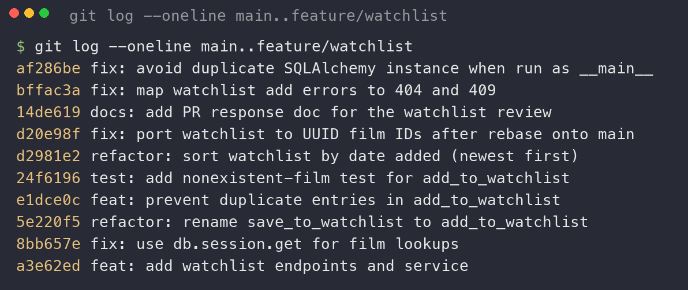

# PR Response Doc — CineLog Watchlist Feature

## AI Usage

**Devil's-advocate pass on Comments 4 & 5.** After drafting each design response, I asked the AI: *"What counterargument would a careful code reviewer raise against this position, and what tradeoff am I not acknowledging?"*
- **Comment 4:** My first draft argued only the community-discovery upside of `public=True`. The AI pushed back with the *harm-asymmetry* argument (a wrongly-public entry is an irreversible privacy leak; a wrongly-private one is a trivial, reversible miss) and noted that "privacy by design" / least-permissive-default is the conventional best practice. That was a real gap, so I revised: I now name the asymmetry explicitly, concede `public=False` is a legitimate position, and add a concrete mitigation (add-time visibility indicator + account-level default toggle) so the public default is *informed* rather than a hidden default.
- **Comment 5:** The AI raised (a) the *watchlist graveyard* failure mode of newest-first and (b) the case that alphabetical helps users scan a long list for a known title. I'd partly anticipated (a); I folded both in — framing `date_added desc` as the right *default* (not the final answer), proposing a user-selectable sort as follow-up, and explaining why the lookup task belongs to search/filter rather than the default order.

The final arguments and the position taken are my own; the AI was used to stress-test them, not to write them.

**Other AI uses during the project:**
- **Codebase orientation.** I asked the AI to summarize `models.py`, `services/collection_service.py`, and `tests/test_collection.py` (responsibilities, key functions, dependencies) before reading them in detail, then verified each summary against the actual source. In particular I had it walk through `add_to_collection()` step-by-step — what the dedup check does and that it *raises* (never returns a duplicate) — which is the pattern I then reimplemented myself for Comment 2.
- **Commit-format verification.** Before finalizing, I gave my `git log --oneline` to the AI and asked whether every message follows Conventional Commits and whether any commit bundles multiple logical changes. It confirmed all ten prefixes are valid (`feat`/`fix`/`refactor`/`test`/`docs`) and each commit is a single logical change; I then re-checked the output myself against the Conventional Commits spec.
- **A caught bug.** While verifying the Comment 5 sort change, a manual check surfaced that `get_watchlist()`'s `entry.film` access had never worked (`WatchlistEntry` had no `film` relationship) — a pre-existing bug I confirmed against the original code and fixed while restoring the model during the Comment 6 rebase.

## Comment 1 — Rename
**What I did:** Renamed `save_to_watchlist()` → `add_to_watchlist()` in `services/watchlist_service.py` so it follows the project's `verb_to_noun` convention (matching `add_to_collection`, `remove_from_collection`, `get_collection`). Updated the one call site in `routes/watchlist/watchlist.py` — both the import on line 8 and the call on line 32.

**How I verified:** Before renaming I ran a project-wide search for the old name to find every reference: `grep -rn "save_to_watchlist" . --exclude-dir=.venv --exclude-dir=.git`. That surfaced exactly three hits — the definition in the service and the import + call in the route. After the rename I re-ran the same search and got zero hits, confirming no stragglers. Then ran the full suite (`pytest tests/ -v`) → 4 passed, so nothing broke. Committed as a standalone `refactor:` commit (`refactor: rename save_to_watchlist to add_to_watchlist`).

## Comment 2 — Deduplication
**What I did:** Added deduplication to `add_to_watchlist()` following the `add_to_collection()` pattern. I studied `add_to_collection()` in `services/collection_service.py`: after confirming the film exists, it queries `CollectionEntry.query.filter_by(user_id=user_id, film_id=film_id).first()` and, if a row comes back, **raises** `AlreadyInCollectionError` — it does not return or silently no-op, so no second row is ever created. I replicated that exactly: defined a new `AlreadyInWatchlistError` in `watchlist_service.py` (parallel to where `collection_service.py` defines its own exceptions), added the `WatchlistEntry.query.filter_by(...).first()` check after the film-existence check, and updated the docstring's `Raises:` section.

**How I verified the logic works:** (1) Full suite still green (`pytest tests/ -v` → 4 passed — the rename/dedup didn't break collection tests). (2) A manual end-to-end check against an in-memory DB: added a film once (succeeded), added the same film again (raised `AlreadyInWatchlistError`), and confirmed `WatchlistEntry.query...count()` stayed at **1** — the duplicate never persisted. Committed separately from the rename (`feat: prevent duplicate entries in add_to_watchlist`).

**Follow-up (now done):** the service-level dedup this comment asked for is complete. In a later hardening pass I also mapped the errors at the HTTP layer — `routes/watchlist/watchlist.py` now catches `AlreadyInWatchlistError` → 409 and `FilmNotFoundError` → 404 (mirroring the collection route) instead of letting them surface as a 500. See the `fix: map watchlist add errors to 404 and 409` commit.

## Comment 3 — Missing test
**What I did:** Created `tests/test_watchlist.py`. I used `test_add_to_collection_nonexistent_film_raises` in `tests/test_collection.py` as my model and wrote the equivalent `test_add_to_watchlist_nonexistent_film_raises` for `add_to_watchlist()`. I followed the same fixture structure (`app` with an in-memory SQLite DB, `sample_user`, `sample_film`) and the same assertion structure (`with pytest.raises(FilmNotFoundError): ...` inside a `with app.app_context():` block).

**Model test used:** `test_add_to_collection_nonexistent_film_raises`. It asserts that adding an unknown film raises `FilmNotFoundError` rather than a raw DB error. My equivalent uses a nonexistent UUID (`00000000-0000-0000-0000-000000000000`) as the missing-film id, matching the model test now that the branch is rebased on `main` and uses UUID film IDs. (In the earlier milestones — before the Comment 6 rebase — this used an integer id; it was switched to a UUID as part of resolving that rebase.)

**How I verified:** `pytest tests/test_watchlist.py -v` → 1 passed. Then `pytest tests/ -v` → **5 passed** (4 collection + 1 watchlist), confirming the new file integrates cleanly. Committed as a standalone `test:` commit (`test: add nonexistent-film test for add_to_watchlist`).

## Comment 4 — Default visibility
**My position:** Keep `public=True` as the default for a new `WatchlistEntry`.

**Reasoning:** CineLog is described up front as a *community* film-tracking app, and its value compounds when members can see each other's activity. A watchlist — "films I *want* to watch" — is arguably the single most useful social signal on the platform, because it expresses forward intent (what I'm about to watch, would discuss, want recommendations on) rather than backward history. Defaulting to public means every new member's list feeds the community's discovery surfaces immediately, without a settings step that the large majority of users never touch (defaults are destiny — most people never change them). The user behavior I'm optimizing for: a newcomer adds three or four films and those instantly appear in "what people are planning to watch," seeding the network effects the product depends on to feel alive. This is also low-sensitivity relative to a *collection*: a watchlist is aspirational, not a record of what you actually watched, and the closest real-world analog — Letterboxd — makes watchlists public by default for exactly these reasons.

**Tradeoff acknowledged:** The cost is that public-by-default is a *privacy-surprising* default. Some users treat a watchlist as private planning, and "want to watch" can still leak sensitive interests (a film's subject may signal health, sexuality, politics, or religion). The harms are asymmetric: a wrongly-*public* entry is an irreversible disclosure the user never affirmatively consented to, whereas a wrongly-*private* entry is only a missed discovery opportunity — cheap and reversible. That asymmetry is the strongest case for the opposite default (`public=False`, i.e. "privacy by design"), and it's a legitimate position. I'm accepting the public default anyway because (a) the per-entry `public` flag already lets a user mark an individual film private, and (b) community discovery is CineLog's core loop, not a bonus. But to keep this an *informed* default rather than a dark pattern, I'd pair it with a visible "this list is public" indicator at add-time and an account-level default toggle — so the tradeoff is disclosed to the user, not hidden from them.

## Comment 5 — Sort order
**My position:** Adopt the maintainer's preference — sort the watchlist by `date_added` descending (newest first). Implemented in `get_watchlist()` (the `refactor: sort watchlist by date added` commit), mirroring `get_collection()`.

**Reasoning:** The maintainer's rationale (consistency with `get_collection`, which is already newest-first) is right, but I want to sharpen *why* rather than just defer to "be consistent." The deeper reason both endpoints should be reverse-chronological is that they're both **activity feeds keyed on the user's own action-time**, not catalogs keyed on the item. Alphabetical-by-title implicitly claims the film's title is the primary access key — that's true for the searchable catalog (`GET /films`), but a personal watchlist is browsed to answer "what do I want to watch next?", and for that question recency-of-intent beats the accident of a title's first letter. Alphabetical also creates an inconsistency the user can feel but not explain: their collection comes back newest-first while their watchlist comes back A–Z.

**Engagement with reviewer's point:** I agree with the maintainer, but not uncritically. Newest-first has a genuine failure mode the suggestion doesn't mention — the *watchlist graveyard*, where films added long ago sink to the bottom and never get watched. So I treat `date_added desc` as the correct **default**, not the final word: no single fixed order serves both "show me what I just added" and "help me finally watch that old one." The right long-term answer is a user-selectable sort (date added / title / release year / runtime) with newest-first as the default. Shipping the sensible default now — and matching `get_collection` — is the correctly-scoped change for this PR; the sort selector is a documented follow-up. (I considered *keeping* alphabetical for users scanning a long list for a specific known title, but that lookup task is better served by search/filter, so it shouldn't dictate the default browse order.)

## Comment 6 — Rebase
**What conflicted:** Two things — one textual, one semantic.
1. **`.gitignore` (textual add/add conflict).** Both `main` (commit `718a9a8`) and my branch added a `.gitignore`. `main`'s version additionally listed `.pytest_cache/`; otherwise they were identical.
2. **`WatchlistEntry` / integer film IDs (semantic — no conflict markers).** `main`'s UUID migration (`07ca580`) rewrote `models.py`: it changed `Film.id` and `CollectionEntry.film_id` to UUID strings **and removed the `WatchlistEntry` model entirely**. My watchlist commits never touched `models.py` (the model had lived in the initial commit), so `git rebase` reported *no* conflict on it — it silently kept `main`'s version. The result applied cleanly at the git level but was broken at runtime: `services/watchlist_service.py` did `from models import WatchlistEntry`, which no longer existed (`ImportError`), and the watchlist code/test still assumed integer `film_id`s.

**How I resolved it:**
- `git fetch origin` then `git rebase origin/main`. Resolved the `.gitignore` conflict by taking the union (kept `.pytest_cache/`), then `git add .gitignore` and `git rebase --continue`.
- Restored `WatchlistEntry` in `models.py` in **UUID** form: `film_id = db.Column(db.String(36), db.ForeignKey("film.id"), ...)`, matching the migrated `CollectionEntry`.
- Added the `Film` ↔ `WatchlistEntry` relationship (`watchlist_entries = db.relationship("WatchlistEntry", backref="film")`). This was missing before the rebase and made `get_watchlist()`'s `entry.film` access raise `AttributeError` on any non-empty list — a pre-existing bug I fixed as part of restoring the model correctly.
- Updated the remaining integer references to UUID: the `film_id` docstrings in the service and route, and swapped the test's integer fake id (`999999`) for a nonexistent UUID (`00000000-0000-0000-0000-000000000000`).
- Committed the resolution as a single follow-up (`fix: port watchlist to UUID film IDs after rebase onto main`).

**How I verified no conflict remains:**
- `git status` clean; `git log --oneline origin/main..HEAD` shows a **linear** stack of my commits on top of `main`.
- `git log --merges origin/main..HEAD` returns **nothing** — no merge commits in the branch (satisfies the "rebase, don't merge" rule in CONTRIBUTING.md).
- `python -c "import services.watchlist_service"` succeeds (the `ImportError` is gone).
- `pytest tests/ -v` → **5 passed**.
- End-to-end check against an in-memory DB: films get UUID ids, `add_to_watchlist` + `get_watchlist` round-trip correctly (returns film dicts incl. `public`), newest-first ordering holds, and duplicate adds still raise `AlreadyInWatchlistError`.

## Commit History (Milestone 4)

Rewrote the branch into clean, Conventional-Commits messages, each one logical change, linear on `main`, no merge commits (two `fix:` commits at the top were added afterward to resolve major errors — see "Post-review fixes" below):



The screenshot above is scoped to `main..feature/watchlist` so it shows exactly the ten commits this branch adds, with **no merge commits** — confirming the branch was rebased (not merged) onto `main`. (The three commits below `a3e62ed` — including the `bbe206c` merge of PR #2 — belong to the upstream starter's `main` and are not part of this branch's work; scoping the log to `main..` excludes them.)

---

## PR Description

### What this feature does
Adds a **watchlist** to CineLog — a per-user list of films a member *wants to watch* (distinct from a *collection*, which is films already watched). It ships:
- `WatchlistEntry` model (UUID ids, matching the rest of the schema after the `main` UUID migration).
- `add_to_watchlist(user_id, film_id)` — validates the film exists (`FilmNotFoundError`) and rejects duplicates (`AlreadyInWatchlistError`).
- `get_watchlist(user_id)` — returns the user's films newest-first, with `date_added` and `public` attached.
- Endpoints: `GET /watchlist/<user_id>` and `POST /watchlist/<user_id>/add`.

### Design decisions
1. **Default visibility — `public=True`.** New watchlist entries are public by default, optimizing for CineLog's community-discovery loop (a "want to watch" list is high-value, low-sensitivity social signal). The acknowledged tradeoff is a privacy-surprising default; `public=False` ("privacy by design") is a legitimate alternative given the harm asymmetry. See **Comment 4** for the full argument and proposed mitigations (add-time visibility indicator + account-level toggle).
2. **Sort order — `date_added` descending (newest first).** Adopted the maintainer's preference over alphabetical-by-title, because a watchlist is an activity feed keyed on the user's own add-time and this matches `get_collection`. The acknowledged limitation is the "watchlist graveyard"; the long-term answer is a user-selectable sort. See **Comment 5**.

### How to manually test
```bash
# 1. Setup (once)
python -m venv .venv && source .venv/bin/activate
pip install -r requirements.txt

# 2. Start the server (either works)
python app.py                                    # serves on http://127.0.0.1:5000
# or:  export FLASK_APP=app:create_app && flask run

# 3. Seed a user and a film (no admin endpoint exists), capturing their UUIDs
flask shell <<'PY'
from app import db
from models import User, Film
u = User(username="alice", email="alice@example.com")
f = Film(title="Dune", year=2021, genre="Sci-Fi")
db.session.add_all([u, f]); db.session.commit()
print("USER", u.id); print("FILM", f.id)
PY

# 4. Exercise the endpoints (substitute the UUIDs printed above)
curl http://127.0.0.1:5000/watchlist/<USER>                         # -> []  (empty)
curl -X POST http://127.0.0.1:5000/watchlist/<USER>/add \
     -H 'Content-Type: application/json' -d '{"film_id":"<FILM>"}'   # -> 201, entry with "public": true
curl http://127.0.0.1:5000/watchlist/<USER>                         # -> [ { ...film..., "public": true } ]
```
Expected: the first GET returns `[]`; the POST returns `201` with the new entry (`public: true`); the second GET returns the film with its watchlist metadata. Add a second film and confirm the most-recently-added appears first (newest-first ordering).

*Automated tests:* `pytest tests/ -v` → 5 passing (4 collection + 1 watchlist).

### Post-review fixes (beyond the six comments)
Two pre-existing major errors surfaced while verifying the feature and are fixed on this branch, each in its own `fix:` commit:
1. **`POST /add` returned `500`** for a duplicate or unknown film. The route now maps `AlreadyInWatchlistError` → `409` and `FilmNotFoundError` → `404`, matching the collection route. (Verified over HTTP: happy `201`, duplicate `409`, unknown film `404`, missing `film_id` `400`.)
2. **`python app.py` crashed every DB request with `500`** ("not registered with this 'SQLAlchemy' instance"). Running the module as `__main__` created a second, uninitialized SQLAlchemy instance; the `__main__` block now imports `create_app` from the module so the served app shares the one `db` models bind to. (Verified: `GET /watchlist/<id>` now returns `200` via `python app.py`.)
